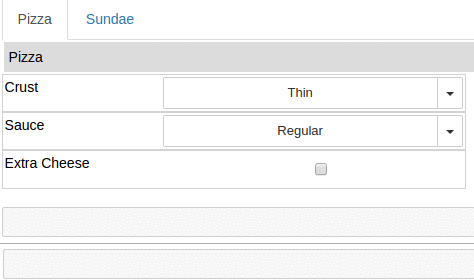

hublib
======

hublib is a Python library for the `HUBzero`_ science gateway platform.  It is designed
to be used with  `Jupyter`_ notebooks on the hubs, although the ui module should work in any notebooks.
Hubs running the Jupyter service
include HUBzero and `nanoHUB`_.  Other hubs will be supported soon.

* hublib.ui - Makes it easy to create a simple GUI for scientific code in a Jupyter notebook.  Built
  on top of `ipywidgets`_ and `pint`_.
* hublib.tool - Convenience functions for controlling and running tools on the hubs.
* hublib.use - Loads hub environment modules.
* hublib.uq - Simplified interface and GUI components for uncertainty quantification.

The complete documentation is hosted at http://hublib.readthedocs.io.

.. image::  docs/images/hublib_complam.gif

.. image::  docs/images/hublib_2.gif

.. _HUBzero: https://hubzero.org/
.. _nanoHUB: https://nanohub.org/
.. _Jupyter: http://jupyter.org/
.. _ipywidgets: https://github.com/ipython/ipywidgets
.. _pint: https://pint.readthedocs.io/
