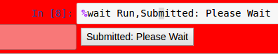

hublib API reference
====================

.. automodule:: hublib
   :members:

ui module
------------------

.. module:: hublib.ui

.. autoclass:: Tab

Creates a tabbed dialog containing the list of widgets.

.. autoclass:: Form

Creates a form, a vertical list of widgets, from *wlist*.  Optional parameters:

:name: The name of the form.  Will appear in a tab or label if the form is put in
   another Form or Tab.

.. autoclass:: Dropdown

Creates a dropdown or pulldown widget.

.. autoclass:: Number

.. autoclass:: Integer

.. autoclass:: String

tool module
-----------

.. module:: hublib.tool

The tool module implements the "line magics" necessary to control
execution of notebooks run in tool mode.

.. function:: %wait [wait_str]

Set a waitpoint at the current cell.  When a "tool mode" notebook
is loaded, it will automatically run until it finishes or hits a waitpoint.
A button is created at the waitpoint. Clicking on the button resumes execution.

:wait_str: Optional. Defaults to "Run,Running".  This is
   the button label before and after clicking.  The two strings
   should be separated by a comma.

Example:

.. image::  images/run.png

After the button is clicked, the second message is displayed

When the notebook is run in tool mode, the code cell is not shown, just the output.

Before:

.. image::  images/run_tool.png

After:

.. image::  images/ran_tool.png

.. function:: %waitdone

Optional. Displays 'DONE' in a highlighted cell at the end of a tool-mode notebook.
