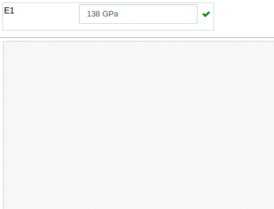
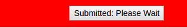

hublib API reference
====================

.. automodule:: hublib
   :members:

ui module
------------------

Widget Groups
-------------

.. module:: hublib.ui

.. class:: Tab(wlist)

    Creates a tabbed dialog containing *wlist*, the list of widgets.  The name of each widget
    will appear in the tabs.

        Attributes:

        .. attribute:: disabled

            Set to True to disable all the contained widgets.

        >>> f = ui.Tab([form1, form2])

        .. note::
            As long as the view exists, the :class:`BytesIO` object cannot be
            resized or closed.

.. class:: Form(wlist, [name="", desc="", disabled=False, width=None])

    A form is a vertically-stacked list of widgets grouped together.

    :param wlist: A list of widgets that make up the form.

    :param name: The name of the form.  Will appear in a tab or label if the form is put in
        another Form or Tab.

    :param desc: An optional description that will appear in a popover dialog.

    :param disabled: The initial state of the form. Defaults to False.

    :param width: Optional width of the form as a percent string (for example, '50%').
        Default is None which sets the width automatically to contain all the
        widgets.

    Attributes:

    .. attribute:: desc

        The form description.

    .. attribute:: disabled

        Set to True to disable all the contained widgets.

    .. attribute:: name

        The form name.

    .. attribute:: visible

        Set to False to hide the form.

    .. attribute:: width

        The form width.

    >>> f = ui.Form([checkbutton1, checkbutton2, num1, string1], name="My Parameters")

Numerical Widgets
-----------------
.. class:: Number(name, value, [cb=None, desc='', disabled=False, units=None, width='auto', min=None, max=None])

    A text field that contains a floating point number with optional units and optional minimum and maximum. Units are converted and min and max checked dynamically.

    :param name: The name that will appear in the field.
    :param value: The initial value.
    :param cb: An optional callback function.
    :param desc: An optional description. This will appear in a popover dialog along with
        unit and min and max values when available.
    :param disabled: The initial state of the form. Defaults to False.
    :param units: A string containing an abbreviation or full name for the unit of measurement.
    :param width: Optional width of the form as a percent string (for example, '50%').
        Default sets the width automatically to contain all the widgets.
    :param min:
    :param max:  Minimum and maximum values.  If a string, may contain units.  Otherwise units will be assumed to
        be the same as those set by the units parameter.

    Attributes:
        Attributes are parameters that may be modified or read after the object is created.
        Unless noted, attributes are read/write.

    .. attribute:: desc

    .. attribute:: disabled

        Set to True to disable the widget.

    .. attribute:: max

    .. attribute:: min

    .. attribute:: name

    .. attribute:: str

        Read-only.  The value as a string, including units.  For example "5.2 m"

    .. attribute:: value

        When read, the value expressed as a floating point number.

        When writing, you can set the value to any expression that can be converted to the proper
        units.  Bad units or values outside the permitted min/max values will cause an exception.

    .. attribute:: visible

        Set to False to hide the widget.

    .. attribute:: width

    >>> e1 = ui.Number(
        name='E1',
        description="Longitudinal Young's Modulus",
        units='GPa',
        min=0,
        max=500,
        value='138 GPa',
        width='20%'
    )

.. class:: Integer(name, value, [cb=None, desc='', disabled=False, width='auto', min=None, max=None])

    A text field that contains an integer with optional minimum and maximum. Min and max are checked dynamically.

    :param name: The name that will appear in the field.
    :param value: The initial value.
    :param cb: An optional callback function.
    :param desc: An optional description. This will appear in a popover dialog along with
        min and max values when available.
    :param disabled: The initial state of the form. Defaults to False.
    :param width: Optional width of the form as a percent string (for example, '50%').
        Default sets the width automatically to contain all the widgets.
    :param min:
    :param max:  Minimum and maximum values.

    Attributes:
        Attributes are parameters that may be modified or read after the object is created.
        Unless noted, attributes are read/write.

    .. attribute:: desc

    .. attribute:: disabled

        Set to True to disable the widget.

    .. attribute:: max

    .. attribute:: min

    .. attribute:: name

    .. attribute:: str

        Read-only.  The value as a string, including units.  For example "5.2 m"

    .. attribute:: value

        When read, the integer value.

        When writing, values outside the permitted min/max values will cause an exception.

    .. attribute:: visible

        Set to False to hide the widget.

    .. attribute:: width

    >>> loops = ui.Integer(
        name='Loops',
        description="Number of Loops to Run",
        min=0,
        max=500,
        value=12,
        width='20%'
    )

    .. image::  images/integer.png

Input Widgets
-------------

.. class:: Checkbutton(name, desc, value, [cb=None, disabled=False, width='auto'])

    >>> check = ui.Checkbox('Advanced Options', 'Show the Advanced Options', value=False, width='50%')
    print check.value
    False

.. class:: Radiobuttons(name, desc, options, value, [cb=None, disabled=False, width='auto'])

    >>> r = ui.Radiobuttons(
            name='Nut',
            description="Type of nut to eat.",
            value='almond',
            options=['peanut', 'walnut', 'almond', 'pecan'],
            width='20%'
        )
    print r.value
    'almond'

.. class:: Dropdown(name, desc, options, value, [cb=None, disabled=False, width='auto'])

    Creates a dropdown or pulldown widget.

    :param name: The name that will appear in the field.
    :param desc: An optional description. This will appear in a popover dialog.
    :param options: A list of strings or dictionay of strings with values.
    :param value: The initial value.
    :param cb: An optional callback function.
    :param disabled: The initial state of the form. Defaults to False.
    :param width: Optional width of the form as a percent string (for example, '50%').
        Default sets the width automatically to contain all the widgets.

    Attributes:
        Attributes are parameters that may be modified or read after the object is created.
        Unless noted, attributes are read/write.

    .. attribute:: disabled

        Set to True to disable the widget.

    .. attribute:: value

    .. attribute:: visible

        Set to False to hide the widget.

    .. attribute:: width

    >>> tb = ui.Dropdown(
            name='Nut',
            description="Type of nut to eat.",
            value='almond',
            options=['peanut', 'walnut', 'almond', 'pecan'],
            width='20%'
        )
    >>> tb.value
    'almond'

    or using a dictionary:

    >>> tb = ui.Dropdown(
            name='Nut',
            description="Type of nut to eat.",
            value=2,
            options={'peanut':1, 'walnut':2, 'almond':3, 'pecan':4},
            width='20%'
        )
    >>> tb.value
    2

    .. image::  images/dropdown.png

.. class:: Togglebuttons(name, desc, options, value, [cb=None, disabled=False, width='auto'])

    Creates a horizontal bar of buttons.  Only one can be selected.

    :param name: The name that will appear in the field.
    :param desc: An optional description. This will appear in a popover dialog.
    :param options: A list of strings or dictionay of strings with values.
    :param value: The initial value.
    :param cb: An optional callback function.
    :param disabled: The initial state of the form. Defaults to False.
    :param width: Optional width of the form as a percent string (for example, '50%').
        Default sets the width automatically to contain all the widgets.

    Attributes:
        Attributes are parameters that may be modified or read after the object is created.
        Unless noted, attributes are read/write.

    .. attribute:: disabled

        Set to True to disable the widget.

    .. attribute:: value

    .. attribute:: visible

        Set to False to hide the widget.

    .. attribute:: width

    >>> tb = ui.Togglebuttons(
            name='Nut',
            description="Type of nut to eat.",
            value='almond',
            options=['peanut', 'walnut', 'almond', 'pecan'],
            width='20%'
        )
    >>> tb.value
    'almond'

    or using a dictionary:

    >>> tb = ui.Togglebuttons(
            name='Nut',
            description="Type of nut to eat.",
            value=2,
            options={'peanut':1, 'walnut':2, 'almond':3, 'pecan':4},
            width='20%'
        )
    >>> tb.value
    2

    .. image::  images/togglebuttons.png

.. autoclass:: String

tool module
-----------

.. module:: hublib.tool

The tool module implements the "line magics" necessary to control
execution of notebooks run in tool mode.

.. function:: %wait [wait_str]

Set a waitpoint at the current cell.  When a "tool mode" notebook
is loaded, it will automatically run until it finishes or hits a waitpoint.
A button is created at the waitpoint. Clicking on the button resumes execution.

:wait_str: Optional. Defaults to "Run,Running".  This is
   the button label before and after clicking.  The two strings
   should be separated by a comma.

Example:

.. image::  images/run.png

After the button is clicked, the second message is displayed

.. image::  images/ran.png

When the notebook is run in tool mode, the code cell is not shown, just the output.

Before:

.. image::  images/run_tool.png

After:

.. function:: %waitdone

Optional. Displays 'DONE' in a highlighted cell at the end of a tool-mode notebook.
