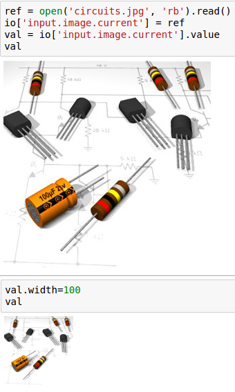

Rappture Module
===============

The rappture module allows notebooks to interact with `Rappture`_  tools.  It can be used to set inputs, launch tools, and visualize outputs.

.. _Rappture: https://nanohub.org/infrastructure/rappture

Getting Started
---------------

You should be familiar with Rappture tools and their "tool.xml" file which
specifies the inputs and outputs of tool runs.

All you need is to::

    import hublib.rappture as rappture

You might also want to set either::

    %matplotlib notebook

for interactive curve plots, or::

    %matplotlib inline

for noninteractive plots.

Loading Rappture Tools
**********************

There are two ways to load a tool.  If the tool is installed, you can simply do::

    io = rappture.Tool("toolname")

Internally this will look for "/apps/toolname/current/rappture/tool.xml".  To load a
non-current or non-installed tool, you must give the full path to the "tool.xml" file::

    io = rappture.Tool("/path/to/tool.xml")

In addition to loading the xml file, the Tool() function will look for an invoke script.  If one is found, it will parse the invoke script and load any modules the tool requires.

Setting Inputs
**************

You can get a list of inputs and outputs (if available) by simply typing the name of the Tool object in a code cell::

    io

To get just inputs, you would enter::

    io.inputs()

You can get more information about a specific input by inspecting the XML representation of the inputs::

    io['input.group(chirality).integer(CarbonTypeN)'].xml()
    [out] <integer id="CarbonTypeN">
                <about>
                    <label>n</label>
                    <description> ... </description>
                </about>
                <min>2</min>
                <max>100</max>
                <default>7</default>
                <current>13</current>
            </integer>

Rappture tools will use the value in the "current" node, so that is the only one
our code should be setting.  Set the value by using the full Rappture XML path, for example::

    io['input.group(chirality).integer(CarbonTypeN).current'] = 12
    io['input.group(chirality).integer(CarbonTypeN).current'].value
    [out] 12

A common error was forgetting the "current" part of the path.  For this reason, the
set method now recognizes when a "current" node is present and will set that
value instead.  So the following will work::

    io['input.group(chirality).integer(CarbonTypeN)'] = 7
    print(io['input.group(chirality).integer(CarbonTypeN)'].value)
    print(io['input.group(chirality).integer(CarbonTypeN).current'].value)
    [out] 7
          7

Using Nodes as Shortcuts
************************

If you have several values to set with a common path, you can set a variable to
the common path node and index from that. For example::

    ch = io['input.group(chirality)']
    print(ch['integer(CarbonTypeN)'].value)
    print(ch['integer(CarbonTypeM)'].value)
    [out] 7
          0

.. _Units:

Working with Units
******************

Rappture uses its own unit system.  However, those units are converted to and from Python `Pint`_ objects.  You can read the docs, however the follwing examples should give you enough background to work with units.

Only Numbers have units.  You should pass units and values with units as strings to the Rappture XML.  When reading then, the value method will return a Python PINT object. For example::

    io['input.number(abc).current'] = '100 cm'
    io['input.number(abc).current'].value
    [out] 1.0 meter

    io['input.number(abc).current'] = '5 yards'
    io['input.number(abc).current'].value
    [out] 4.572 meter

You can get magnitude with the **magnitude** method and units with the **units** method.  Or you can get them with the PINT methods::

    io['input.number(abc).current'].value
    [out] 4.572 meter
    io['input.number(abc).current'].magnitude
    [out] meter
    val =  io['input.number(abc).current'].value
    print('Magnitude is', val.m, 'and units are', val.u)
    [out] Magnitude is 4.572 and units are meter

To convert units, use **to**::

    val.to('mm')
    [out] 4572.0 millimeter

Running the Tool
****************

When you have the inputs set, you can run the tool with a single command::

    io.run(verbose=True)

When verbose is set, it will echo the command it is executing to run the tool.  Verbose is False by default.

Reading the Outputs
*******************

To get a list of results::

    io.outputs()

Outputs are read just like inputs.

Getting the Raw Value
*********************

XML stores everything as strings.  The **value** method converts those string to appropriate python types.  If you want the unconverted raw string value, use the **rvalue** method for this::

    print(io['output.curve(DOS).component.xy'].rvalue)
    [out] -10.0 0.0
        -9.999 0.0
        -9.998 0.0
        -9.997 0.0
        -9.996 0.0
        ...

Input and Output Elements
-------------------------

boolean
*******

As an input element, *boolean* displays a checkbox.  The current value should be set to True or False.

An output element will always return a Python boolean; either True or False.

.. seealso:: https://nanohub.org/infrastructure/rappture/wiki/rp_xml_ele_boolean

curve
*****

A curve object represents a list of (x,y) data points.  Curves may be members of groups, indicating they should be plotted on the same graph.

To plot an output curve, simply call **plot()**.  However you should first set the matplotlib output to either *inline* or *notebook*.  *inline* just writes a static image in the notebook.  *notebook* allows some interaction (zooming and resizing) with the output.  It needs to be set only once and will apply to all cells folowing it.::

    %matplotlib notebook
    io['output.curve(DOS)'].plot()

.. function:: plot(single=False, ax=None)

   Plot a curve or group of curves.

   :param single: Only plot a single curve, even if part of a group.
   :type single: boolean
   :param ax:  Matplotlib axis.

    >>> fig, axs = plt.subplots(1,2)
    io['output.curve(plot1)'].plot(ax=axs[0]);
    io['output.curve(plot2)'].plot(ax=axs[1]);

Scattterplots and styles are not yet implemented.

.. seealso:: https://nanohub.org/infrastructure/rappture/wiki/rp_xml_ele_curve

image
*****

An image object represents some photographic image.  When setting inputs, the image data must be GIF, JPEG, or PNG.

When reading, the value returned will be an Image object.

.. seealso:: https://nanohub.org/infrastructure/rappture/wiki/rp_xml_ele_image

integer
*******

An integer object represents an integer value with no units:

.. seealso:: https://nanohub.org/infrastructure/rappture/wiki/rp_xml_ele_integer

log
***

The <log> element appears in the output section. It is used to store the textual output log from a simulation.

When reading from xml, it returns a Python string.

.. seealso:: https://nanohub.org/infrastructure/rappture/wiki/rp_xml_ele_log

number
******

A number object represents a real value with an optional system of units.

Unitless elements return a float.  For more information about units, see
Units_

.. seealso:: https://nanohub.org/infrastructure/rappture/wiki/rp_xml_ele_number

string
******

A string object represents a single-line or multi-line text value.
When reading from xml, it returns a Python string.

.. seealso:: https://nanohub.org/infrastructure/rappture/wiki/rp_xml_ele_string

structure
*********

Structures can represent many different things.  Currently only the molecule
viewer is implemented.

.. function:: plot()

    Display structure

.. seealso:: https://nanohub.org/infrastructure/rappture/wiki/rp_xml_ele_structure

.. _Pint: https://pint.readthedocs.io/en/0.7.2/