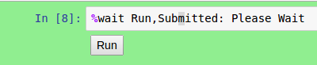
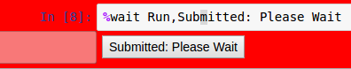

Tool Module
===========

.. module:: hublib.tool

The tool module implements the "line magics" necessary to control
execution of notebooks run in tool mode.  It is now deprecated in favor
of the new dashboards tool. It will liekly be removed in the future.

%wait
*****

.. function:: %wait [wait_str]

Set a waitpoint at the current cell.  When a "tool mode" notebook
is loaded, it will automatically run until it finishes or hits a waitpoint.
A button is created at the waitpoint. Clicking on the button resumes execution.

:wait_str: Optional. Defaults to "Run,Running".  This is
   the button label before and after clicking.  The two strings
   should be separated by a comma.

Example:

After the button is clicked, the second message is displayed

When the notebook is run in tool mode, the code cell is not shown, just the output.

Before:

After:

%waitdone
*********

.. function:: %waitdone

Optional. Displays 'DONE' in a highlighted cell at the end of a tool-mode notebook.
